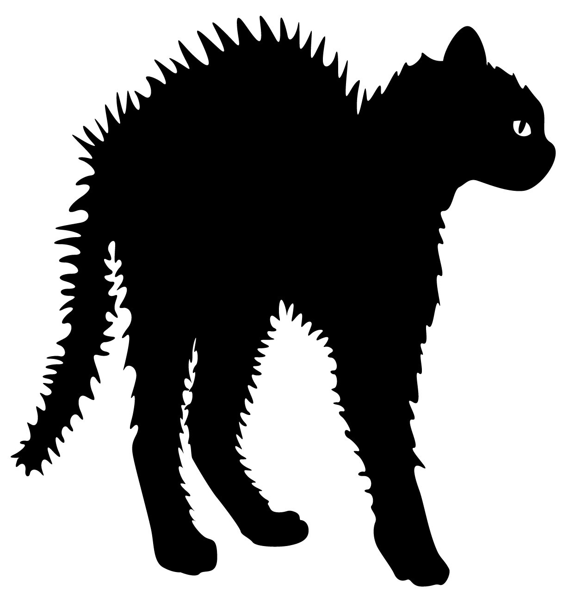
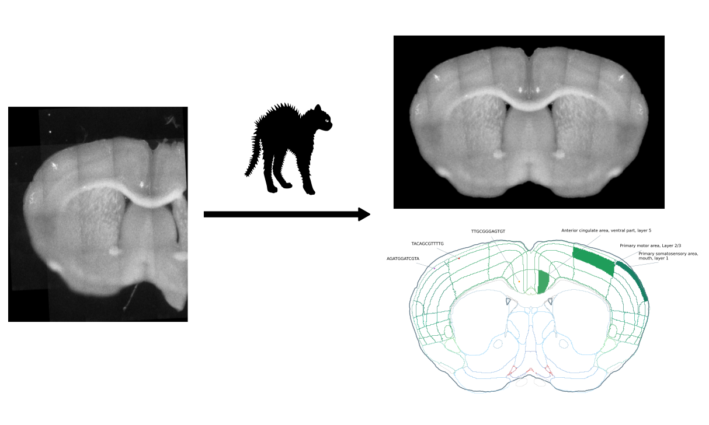

# Coronal Hemisphere Annotation Tool (CHAT)

The coronal hemisphere annotation tool is a pipeline for annotating
samples from mouse coronal slice hemispheres with the Allen Brain
Atlas.

As inputs, it takes (a) microscopy autofluorescence images of mouse
coronal slice hemispheres and (b) sample data in CSV format including
the precise locations of the samples in the images. It segments and
aligns the (stitched) images, and registers them to the Allen Brain
Atlas reference volume. In this process, it keeps track of the given
sample locations, and returns their corresponding atlas annotations.

Some parts of the pipeline are rather specific to our in-house setup
but the core functionality has been written with re-usability in mind,
specifically the scripts:

- hemisphere_segmentation_and_alignment.py
- image_registration.py
- image_annotation.py
- sample_annotation.py




## Installation

1. Install anaconda, instructions [here](https://docs.anaconda.com/free/anaconda/install/index.html).

2. Download and unzip this repository.

3. Open a console and navigate to the repository top directory.

``` shell
cd /path/to/coronal_hemisphere_annotation_tool/
```

4. Create a virtual environment that contains the required dependencies.

``` shell
conda create --name chat -f environment.yml python=3.7
```

## Before every use

1. Open a console and navigate to the repository top directory.

``` shell
cd /path/to/coronal_hemisphere_annotation_tool/
```

2. Activate the conda virtual environment.

``` shell
conda activate chat
```

## Running the pipeline

Run the pipeline scripts in the following order.

### Extract slice specific sample data from a larger data set

This script queries a sample data CSV spreadsheet, extracts all
rows that in the indicated column contain the indicated string, and
writes the results to a new CSV file containing only the slice specific
data.

The output CSV contains the same columns as the input CSV as well as
the column 'sample_id', which is just the corresponding index in the
inoput CSV file.

Usage:

``` shell
python code/extract_sample_data.py /path/to/sample_data.csv column pattern /path/to/slice_specific_sample_data.csv
```

Example:

``` shell
python code/extract_sample_data.py data/plates_6_11_12_13_14_16_17_18.csv date 2019-03-22 test/sample_data.csv --show
```

### Convert sample coordinates to image pixel locations

Given sample coordinates in micrometers, this script determines the
corresponding image pixels.

The sample data CSV has to contain the following columns:

- slice_number,
- image_x,
- image_y.

The images in the image directory have to be TIFF files containing
XResolution and YResolution meta data tags, and have to match the
following file name pattern: Image_[0-9]_*.tif, where the number
indicates the slice number.

Usage:

``` shell
python code/convert_sample_coordinates.py /path/to/slice_specific_sample_data.csv /path/to/image/directory/
```

Example:

``` shell
python code/convert_sample_coordinates.py test/sample_data.csv test/
```

### Segmentation of the left coronal hemisphere & alignment of segmented sections

This script prepares a series of mouse coronal hemisphere sections for registration in the following steps:

1) Isolate a single hemisphere (remove background, other hemisphere) in each image.
2) Reflect hemispheres to create complete coronal sections.
3) Align sections with each other in one image stack.

The images in the image directory have to be TIFF files, and have to
match the following file name pattern: Image_[0-9]_*.tif, where the
number indicates the slice number.

Sample coordinates are provided as a CSV spreadsheet.
These coordinates are then transformed such that locations in the input image
are mapped to the right locations in the output image.
The spreadsheet has to contain the following four columns:

- sample_id    : an integer sample ID,
- image_row    : the X coordinate (or column) in the input image,
- image_col    : the Y coordinate (or row) in the input image, and
- slice_number : the Z coordinate (or slice number).

This script creates the following files in the provided output directory:

- an NPZ file containing the aligned image stacks and masks (open with numpy.load), and
- the segmented and aligned slices as individual PNG files (for registration).

Furthermore, the script adds two columns to the CSV spreadsheet

- segmentation_row, and
- segmentation_col,

which are the sample locations (in pixels) in the segmented output images.

Usage:

``` shell
python code/hemisphere_segmentation_and_alignment.py /path/to/image/directory/ /path/to/sample_data.csv /path/to/output/directory/
```

Example:

``` shell
python code/hemisphere_segmentation_and_alignment.py test/ test/sample_data.csv test/segmentation/
```

### Image registration to the Allen Brain Atlas using DeepSlice

Register a series of mouse coronal sections to the Allen Brain Atlas using [DeepSlice](https://github.com/PolarBean/DeepSlice).

The images in the image directory have to be PNG files, and have to
match the following file name pattern: Image_s[0-9]*.png, where the
number indicates the slice number.

Usage:

``` shell
python code/image_registration.py /path/to/segmentation/directory/ /path/to/output/directory/ --slice_direction <caudal-rostro OR rostro-caudal> --slice_thickness <float>
```

Example:

``` shell
python code/image_registration.py test/segmentation test/registration --slice_direction caudal-rostro --slice_thickness 150
```

### Image annotation with Allen Brain Atlas

Use the image registration results to query the Allen Brain Atlas for
a corresponding annotation.

The Allen Brain data directory is a used to deposit a copy of the
Allen Brain mouse atlas. The atlas is downloaded the first time this
script is executed and then used in any subsequent invocations.

Usage:

``` shell
python code/image_annotation.py /path/to/registration/results.csv /path/to/allen/brain/data/directory/ /path/to/output/directory/
```

Example:

``` shell
python code/image_annotation.py test/registration/deepslice_registration_results.csv data/ test/annotation/
```

### Sample annotation

Annotate samples based on image annotation results.

Usage:

``` shell
python code/sample_annotation.py /path/to/annotation/directory/ /path/to/sample_data.csv
```

Example:

``` shell
python code/sample_annotation.py test/annotation/ test/sample_data.csv
```

### Visualise results

Usage:

``` shell
python code/make_figures.py /path/to/segmentation/directory/ /path/to/annotation/directory/ /path/to/sample_data.csv /path/to/figure/directory/
```

Example:

``` shell
python code/make_figures.py test/segmentation/ test/annotation/ test/sample_data.csv test/figures/
```
